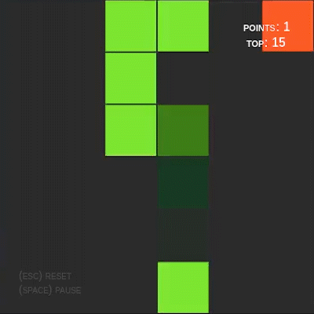

# LearnSnake

This is a implementation of an Artificial Intelligence fully written in Javascript that learns to play Snake using Reinforcement Learning.

It runs directly in the browser, no installation is necessary. You can see it working and tweak some variables.

## [- Try it yourself -](https://italolelis.com/LearnSnake)

# References

- [Watkins, Christopher JCH, and Peter Dayan. "Q-learning." Machine learning 8.3-4 (1992): 279-292](https://link.springer.com/article/10.1007/BF00992698)

- [Machine Learning for Humans, Part 5: Reinforcement Learning](https://medium.com/machine-learning-for-humans/reinforcement-learning-6eacf258b265)
- [Coding “Snake” in 4 min 30 sec](https://www.youtube.com/watch?v=xGmXxpIj6vs)
- [Q-Learning-Python-Example](https://github.com/hasanIqbalAnik/q-learning-python-example)